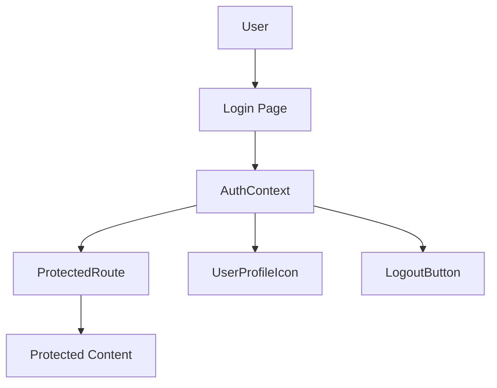
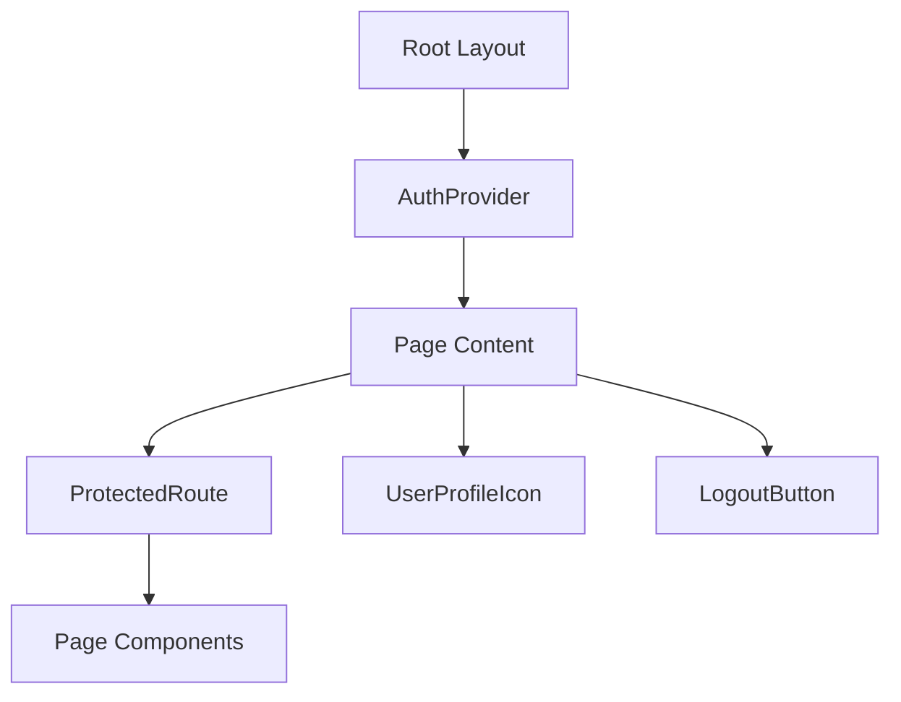

# Component Architecture and Data Flow

This document describes the component relationships and data flow in the YourCommunity.Space application.

## Core Components

### Authentication Flow


### Component Hierarchy


## Data Flow

### Authentication State
1. **Initial Load**
   - `AuthProvider` initializes
   - Fetches user data from `/api/profile`
   - Updates context with user state

2. **Login Process**
   - User enters email
   - Receives verification code
   - `AuthContext.login()` verifies code
   - Updates user state
   - Redirects based on profile completion

3. **Logout Process**
   - `LogoutButton` or `UserProfileIcon` triggers logout
   - `AuthContext.logout()` clears session
   - Redirects to home page

### Protected Routes
1. **Route Protection**
   - `ProtectedRoute` checks auth state
   - Shows loading spinner during check
   - Redirects to login if unauthenticated
   - Renders children if authenticated

2. **Profile Management**
   - `UserProfileIcon` shows different states:
     - Loading state
     - Login link
     - Profile completion prompt
     - User avatar

## Component Responsibilities

### AuthProvider
- Manages authentication state
- Provides login/logout functions
- Handles user profile updates
- Manages loading states
- Error handling

### ProtectedRoute
- Route protection logic
- Loading state display
- Authentication check
- Redirect handling

### UserProfileIcon
- User state display
- Profile completion check
- Logout functionality
- Navigation to profile

### LogoutButton
- Logout trigger
- Session clearing
- Error handling
- Navigation after logout

## State Management

### Global State (AuthContext)
```typescript
interface AuthContextType {
  user: User | null;
  loading: boolean;
  error: string | null;
  login: (email: string, code: string) => Promise<{ needsProfileCompletion: boolean }>;
  logout: () => Promise<void>;
  updateUser: (userData: Partial<User>) => void;
}
```

### User State
```typescript
interface User {
  name: string;
  email: string;
  phoneNumber?: string | null;
}
```

## API Integration

### Authentication Endpoints
- `/api/auth/send-link` - Send authentication link
- `/api/auth/verify-code` - Verify authentication code
- `/api/auth/logout` - Handle logout
- `/api/auth/complete-registration` - Complete user profile

### Profile Endpoints
- `/api/profile` - Get/update user profile
- `/api/register` - Register new user

## Error Handling

### Authentication Errors
- Invalid credentials
- Session expiration
- Network failures
- Profile completion required

### Component Error States
- Loading states
- Error messages
- Fallback UI
- Recovery actions

## Security Considerations

### Route Protection
- Client-side protection via `ProtectedRoute`
- Server-side validation in API routes
- Session management
- Cookie security

### Data Flow Security
- HTTP-only cookies
- Secure cookie options
- CSRF protection
- Input validation

## Performance Considerations

### Loading States
- Skeleton loading
- Progress indicators
- Optimistic updates
- Error boundaries

### State Updates
- Minimal re-renders
- Efficient context usage
- Optimized API calls
- Caching strategies